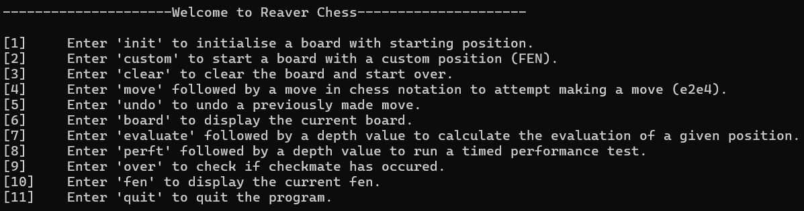

## ♟️ Command Line Interactive Chess Software

A lightweight command-line tool for working with chess positions. It supports interactive move navigation, position analysis, and performance testing for chess engines.

### ✨ Features
- Navigate through chess positions by making and undoing moves.
- Run fast **performance test (perft)** functions to benchmark against your own engines.
- Request board states or FEN (Forsyth–Edwards Notation) at any point for precise position tracking.

---

## 🛠️ Available Functions

The image below illustrates the full set of available functionalities:

---

## ⚠️ Note

🧠 The **evaluation function** is currently under development and not finalized. Contributions or suggestions are welcome!
