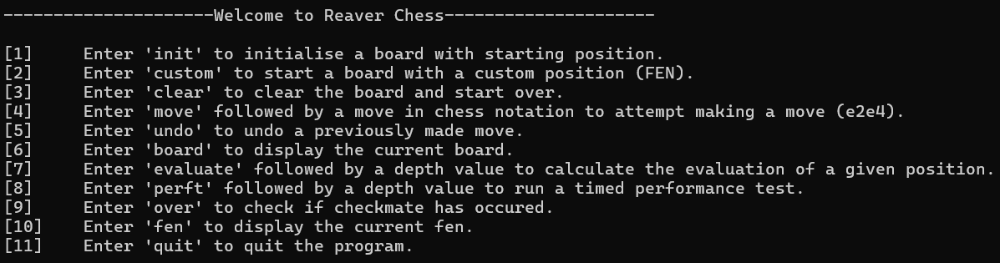

## ♟️ Command Line Interactive Chess Software

A lightweight command-line tool for working with chess positions. It supports interactive move navigation, position analysis, and performance testing for chess engines.

### ✨ Features
- Navigate through chess positions by making and undoing moves.
- Run fast **performance test (perft)** functions to benchmark against your own engines.
- Request board states or FEN (Forsyth–Edwards Notation) at any point for precise position tracking.

---

## 🛠️ Available Functions

The image below illustrates the full set of available functionalities:



---

## 🚀 How to Run

#### 1. **Clone the Repository**
```bash
git clone https://github.com/FadilElbshari/Reaver-Chess.git
cd Reaver-Chess
```
#### 2. **Run the run.py python script**
```bash
python run.py
```
### 3. ***Run executable**
- An executable with the name main will be available in the main directory.
  ```bash
  ./main
  ```

---

## ⚠️ Note

🧠 The **evaluation function** is currently under development and not finalized. Contributions or suggestions are welcome!
